<div align="center">
  

# 🍽️ MealMetrics

### AI-Powered Calorie Tracking Telegram Bot

  [](https://python.org)
  [](https://core.telegram.org/bots)
  [](LICENSE)

  **Transform your nutrition tracking with AI-powered food analysis!**

  [🤖 Try Live Bot](https://t.me/MealMetrics_bot) • [🐛 Report Bug](https://github.com/mrx-arafat/MealMetrics/issues) • [💡 Request Feature](https://github.com/mrx-arafat/MealMetrics/issues)

</div>

---

## Overview

MealMetrics is an intelligent Telegram bot that revolutionizes how you track your daily nutrition. Simply send a photo of your meal, and our advanced AI will analyze the food, estimate calories, and provide detailed nutritional insights with cool recommendations.

### Key Features

- **Smart Food Recognition** - Advanced AI vision analysis with caption-priority system
- **Accurate Calorie Estimation** - Precise nutritional breakdown with macronutrients
- **Enhanced Consistency** - Image hashing and caching for consistent analysis results
- **Ultra-Smart Detection** - Improved handling of blurry images with image enhancement
- **Health Scoring** - Intelligent health assessment (1-10 scale)
- **Daily Tracking** - Complete meal history and statistics
- **Witty AI Personality** - Engaging recommendations, especially for junk food
- **Robust Error Handling** - Improved reliability with comprehensive error recovery
- **Reliable Photo Processing** - Enhanced handling of photo analysis errors
- **Flexible Storage** - Support for both SQLite and MySQL databases
- **Privacy First** - Your data stays secure and private

## How It Works

1. **Send a Photo** - Take a clear photo of your meal and send it to the bot
2. **AI Analysis** - Advanced AI analyzes the image and estimates calories
3. **Review & Confirm** - Check the analysis and choose to log or cancel
4. **Track Progress** - View your daily intake and comprehensive statistics

## Self-Hosting Setup

If you want to run your own instance of MealMetrics bot:

### Prerequisites

- **Python 3.8+** - [Download Python](https://python.org/downloads/)
- **Telegram Bot Token** - Get from [@BotFather](https://t.me/BotFather)
- **OpenRouter API Key** - Sign up at [OpenRouter.ai](https://openrouter.ai/)

### Installation

1. **Clone the repository**

   ```bash
   git clone https://github.com/mrx-arafat/MealMetrics.git
   cd MealMetrics
   ```
2. **Install dependencies**

   ```bash
   pip install -r requirements.txt
   ```
3. **Configure environment**

   ```bash
   cp .env.example .env
   # Edit .env with your API keys
   ```
4. **Set up your `.env` file**

   ```env
   TELEGRAM_BOT_TOKEN=your_telegram_bot_token_here
   OPENROUTER_API_KEY=sk-or-v1-your_openrouter_api_key_here
   OPENROUTER_MODEL=google/gemini-2.5-flash-preview
   DATABASE_PATH=mealmetrics.db
   MAX_IMAGE_SIZE_MB=10
   SUPPORTED_IMAGE_FORMATS=jpg,jpeg,png,webp
   ```
5. **Launch the bot**

   ```bash
   python main.py
   ```

### Getting API Keys

**Telegram Bot Token:**

1. Open Telegram and search for [@BotFather](https://t.me/BotFather)
2. Send `/newbot` command
3. Follow the instructions to create your bot
4. Copy the provided token to your `.env` file
5. Optionally, set a profile picture and description

**OpenRouter API Key:**

1. Visit [OpenRouter.ai](https://openrouter.ai/) and create an account
2. Navigate to the **API Keys** section
3. Click **Create New Key**
4. Copy the key (starts with `sk-or-v1-`)
5. Add credits to your account for API usage

## Usage Guide

### Bot Commands

| Command    | Description                                 |
| ---------- | ------------------------------------------- |
| `/start` | Initialize the bot and show welcome message |
| `/help`  | Show help information and tips              |
| `/menu`  | Display the main menu with options          |
| `/today` | Show today's calorie summary and meals      |
| `/stats` | View detailed statistics and analytics      |
| `/clear` | Clear today's meal data (with confirmation) |

### Workflow

```mermaid
flowchart TD
    A[📸 User sends food photo] --> B[🔍 Caption analysis]
    B --> C[🤖 AI vision processing]
    C --> D[📊 Nutritional analysis]
    D --> E[💬 Bot sends results]
    E --> F{User decision}
    F -->|✅ Log Meal| G[💾 Save to database]
    F -->|❌ Cancel| H[🗑️ Discard analysis]
    G --> I[📈 Update daily stats]
    I --> J[📋 Available in /today]
```



**Step-by-step process:**

1. **Send Photo** - User takes a photo of their meal and sends it to the bot
2. **Caption Priority** - Bot prioritizes any text caption over visual analysis
3. **AI Processing** - Advanced AI analyzes the image for food identification and portions
4. **Analysis Results** - Bot provides calories, health score, and nutritional breakdown
5. **User Choice** - User can log the meal or cancel the analysis
6. **Data Tracking** - Logged meals update daily statistics and history

### 💡 Pro Tips for Accuracy

**📸 Photography Tips:**

- ✅ Use natural lighting when possible
- ✅ Include the entire meal in frame
- ✅ Use standard plate/bowl sizes for reference
- ❌ Avoid shadows covering the food
- ❌ Don't crop important parts of the meal

**📝 Caption Tips:**

- ✅ Add specific food descriptions
- ✅ Mention quantities (e.g., "500ml", "2 pieces")
- ✅ Specify preparation methods (grilled, fried, etc.)
- ✅ Note modifications ("no sugar", "extra spicy")
- ✅ Include brand names when relevant

### Caption Examples

- `"Grilled chicken breast 200g with steamed broccoli"`
- `"Mango juice 500ml no sugar added"`
- `"Homemade pizza slice with pepperoni"`
- `"Starbucks grande latte with oat milk"`

## Architecture

### Project Structure

```
MealMetrics/
├── main.py                    # Application entry point
├── requirements.txt           # Dependencies
├── .env.example              # Environment template
├── README.md                 # Documentation
├── bot/                      # Telegram bot logic
│   ├── handlers.py           # Message & callback handlers
│   ├── keyboards.py          # Inline keyboard layouts
│   └── states.py             # Conversation states
├── ai/                       # AI analysis engine
│   ├── vision_analyzer.py    # Food image analysis
│   └── prompts.py            # AI prompts & instructions
├── database/                 # Data persistence layer
│   ├── factory.py            # Database factory pattern
│   ├── models.py             # SQLite database models
│   ├── operations.py         # Core meal operations
│   ├── mysql_manager.py      # MySQL connection manager
│   └── mysql_operations.py   # MySQL-specific operations
├── utils/                    # Utility functions
│   ├── config.py             # Configuration management
│   └── helpers.py            # Helper functions
└── shared/                   # Shared resources
    └── logo/                 # Brand assets
        └── mealmatrics.png   # Bot logo
```

### Database Schema

**SQLite Tables:**

| Table               | Purpose                  | Key Fields                                                |
| ------------------- | ------------------------ | --------------------------------------------------------- |
| `users`           | User profiles & settings | `user_id`, `username`, `created_at`                 |
| `meals`           | Individual meal records  | `meal_id`, `user_id`, `calories`, `timestamp`     |
| `daily_summaries` | Daily aggregated data    | `user_id`, `date`, `total_calories`, `meal_count` |
| `pending_meals`   | Temporary meal storage   | `user_id`, `image_data`, `analysis_result`          |

### Tech Stack

- **Backend**: Python 3.8+ with asyncio
- **Bot Framework**: python-telegram-bot 20.7
- **AI Vision**: Google Gemini 2.5 Flash via OpenRouter
- **Database**: SQLite (default) / MySQL (optional)
- **Image Processing**: Pillow (PIL)
- **HTTP Client**: httpx for async requests

## Troubleshooting

### Common Issues & Solutions

**Bot Not Responding**

```bash
# Check bot status
python main.py

# Verify token
grep TELEGRAM_BOT_TOKEN .env
```

- Verify bot token in `.env`
- Ensure bot is running
- Check internet connection
- Confirm bot is not blocked

**Image Analysis Fails**

```bash
# Check API credits
curl -H "Authorization: Bearer $OPENROUTER_API_KEY" \
     https://openrouter.ai/api/v1/auth/key
```

- Verify OpenRouter API key and credits
- Try clearer, well-lit photos
- Ensure supported image format (JPG, PNG, WebP)
- Check image size (< 10MB)

**Database Errors**

```bash
# Check database permissions
ls -la mealmetrics.db

# Test database connection
python test_database.py
```

- Verify file permissions
- Ensure SQLite is installed
- Check disk space

### Logs & Debugging

The bot generates detailed logs in `mealmetrics.log`:

```bash
# View recent logs
tail -f mealmetrics.log

# Search for errors
grep ERROR mealmetrics.log
```

## Contributing

We welcome contributions! Here's how you can help:

### Bug Reports

- Use the [issue tracker](https://github.com/mrx-arafat/MealMetrics/issues)
- Include logs and steps to reproduce
- Specify your environment (OS, Python version)

### Feature Requests

- Check existing [issues](https://github.com/mrx-arafat/MealMetrics/issues) first
- Describe the feature and use case
- Consider implementation complexity

### Pull Requests

1. Fork the repository
2. Create a feature branch: `git checkout -b feature-name`
3. Make your changes with tests
4. Submit a pull request with clear description

### Development Setup

```bash
# Clone your fork
git clone https://github.com/your-username/MealMetrics.git
cd MealMetrics

# Install development dependencies
pip install -r requirements.txt

# Run tests
python -m pytest

# Format code
black .
```

## License

This project is licensed under the **MIT License** - see the [LICENSE](http://profile.arafatbytes.live/) file for details.

## Disclaimer

**Important**: Calorie estimates are approximations based on AI analysis of food photos. Results may vary and should not be considered as exact nutritional information. Always consult with healthcare professionals for specific dietary needs and medical advice.

## 👨‍💻 Author

**Easin Arafat**

- 🌐 GitHub: [@mrx-arafat](https://github.com/mrx-arafat)

---

<div align="center">

**Built for sigma males. 💪**

*Track your gains, not your feelings.*

</div>
